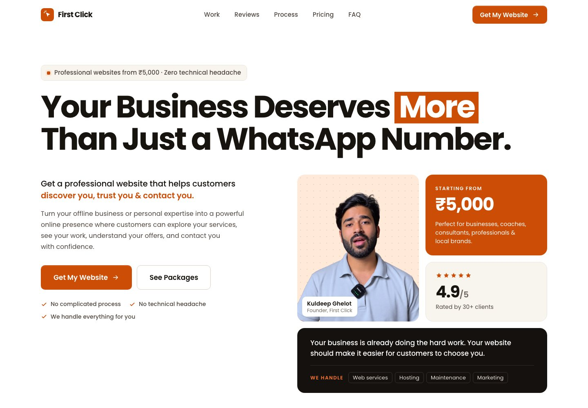

# First Click — Landing Page

A responsive landing page for First Click, a service that builds professional websites for Indian small businesses, coaches, consultants and local brands, starting from ₹5,000.

[**View the live site**](https://kuldeep24bca.github.io/first-click-website/) · [**View the source**](https://github.com/kuldeep24bca/first-click-website)



## What it does

- Walks a visitor through the decision in order: the problem, the solution, who it's for, what's included, example layouts, client reviews, the founder, the process, pricing, FAQs and a final call to action.
- Lays every section on a 12-column bento grid that recomposes for tablet and phone (for example, reviews become a swipeable row on phones and small cards switch to a compact icon-left layout).
- Adds light interaction: a sticky nav whose underline follows the section in view, a mobile menu, counting stats, "Read more" on reviews, an accessible FAQ accordion, and a price bar that appears on phones after the hero. Motion is disabled for visitors who prefer reduced motion.

## How it is made

Plain HTML, CSS and JavaScript — no framework, build step or package install. `index.html` holds the markup and an inline SVG icon sprite. Styles are split by section in `css/`, all driven by the design tokens in `css/variables.css` (one brand orange, warm neutrals, a spacing scale and theme classes for white, cream, dark and orange sections).

The brand orange `#CC4D06` was chosen as the brightest orange that keeps white button text at WCAG AA contrast; a brighter orange is used only on dark sections. The "What we build" website previews are drawn in HTML/CSS and scale with container query units rather than using screenshots.

`js/main.js` handles navigation, scroll reveals, counters, review toggles and the mobile price bar. `js/faq.js` runs the accordion.

## Configuration

Every "Get My Website" button scrolls to the final call-to-action section. To send visitors to WhatsApp instead, set your number (country code + number, digits only) at the top of `js/main.js`:

```js
const WHATSAPP_NUMBER = '919876543210';
```

Buttons then open WhatsApp with a pre-filled message, including the chosen package on pricing buttons.

## Run locally

```bash
python3 -m http.server 4180
```

Then visit `http://localhost:4180`. Any static file server works. An internet connection is needed for the Poppins font from Google Fonts; without it the page falls back to system fonts.

## Project structure

```text
first-click-website/
├── index.html          # Markup, icon sprite, all page sections
├── css/
│   ├── variables.css   # Design tokens and section themes
│   ├── base.css        # Reset, type, grid, buttons, cards, motion
│   └── *.css           # One stylesheet per section (nav, hero, pricing…)
├── js/
│   ├── main.js         # Nav, reveals, counters, reviews, sticky CTA
│   └── faq.js          # FAQ accordion
├── images/             # Favicon and founder photos (WebP)
└── assets/preview.jpg  # README screenshot
```

## Notes

- The website previews in "What we build" are illustrative layouts, not screenshots of client projects.
- No license is included, so reuse rights are not granted. All content and photos belong to First Click.
